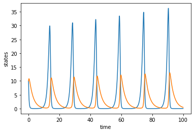
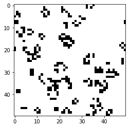
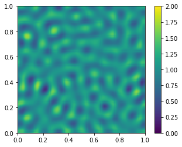
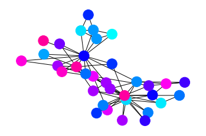
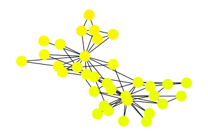

# Demo


```python
import numpy as np
import matplotlib.pyplot as plt
import networkx as nx
import matplotlib_inline.backend_inline
matplotlib_inline.backend_inline.set_matplotlib_formats("png")

from mcs import DE, ODE, CA, PDE, Net
```

## Lotka-Volterra equations
$dx/dt = ax - bxy$  
$dy/dt = dxy - cy$


```python
ode = ODE(max_step=10000, dim=2, dt=0.01)
ode.initialize(x0=[10, 10])
ode.simulate(f=ode.lv(a=1.1, b=0.4, c=0.4, d=0.1))
fig = ode.visualize()
ax = fig.axes[0]
ax.set_xlabel('time')
ax.set_ylabel('states')
plt.show()
```


    

    


## Game of life


```python
ca = CA(max_step=100, size_x=50, size_y=50)
ca.initialize()
ca.simulate(F=ca.game_of_life)
fig = ca.visualize()
plt.show()
```


    

    


## Turing pattern
Reaction-diffusion equations:

$\partial u/\partial t = a(u-h) + b(v-k) + D_u \Delta u$  
$\partial v/\partial t = c(u-h) + d(v-k) + D_v \Delta v$

Initial small pertubations are applied to the homogeneous equilibrium state $(h, k)$.


```python
pde = PDE(max_step=2500, dim=2, dt=0.02, dh=0.01, size=100)
pde.initialize()
pde.simulate(F=pde.turing(a=1.0, b=-1.0, c=2.0, d=-1.5, h=1.0, k=1.0, Du=0.0001, Dv=0.0006, dh=0.01))
figs = pde.visualize(indices=[0])
plt.show()
```


    

    


## Synchronization of network of coupled oscillators
$d\theta_i/dt = b\theta_i + a\sum_{j\in N_i}(\theta_j-\theta_i)$

Stable trajetory: $b - a\lambda_2 < 0$, where $a\ge 0$ and $\lambda_2$ is the second smallest eigenvalue of Laplacian matrix.


```python
net = Net(max_step=2000)
net.initialize()
net.simulate(a=2, b=0.9, dt=0.01)
fig = net.visualize(step=0)
fig = net.visualize()
plt.show()
```


    

    


    

    

